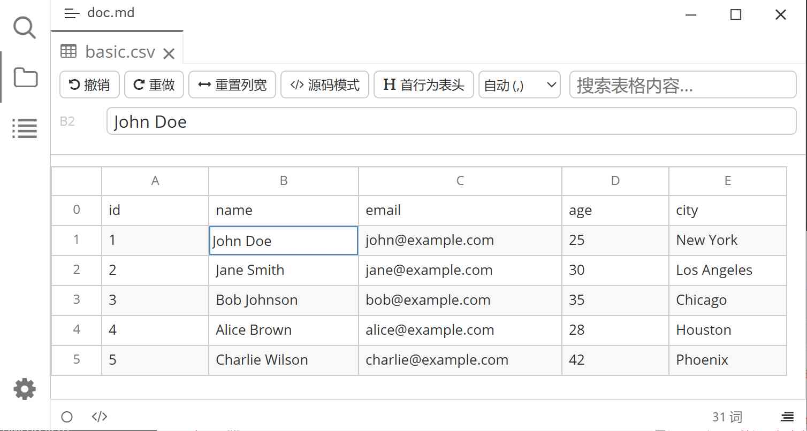

# Typora Plugin CSV

English | [中文](./README.zh-CN.md)

This is a [Typora](https://typora.io) plugin based on [typora-community-plugin][core]. It provides visual table editing capabilities for `.csv` / `.tsv` files, inspired by Obsidian's csv-lite table editor.

Click a `.csv` / `.tsv` file in the file tree to open it as an editable table in a tab: add/delete rows and columns, drag to reorder, search, pin rows and columns, and edit source—all changes are automatically written back to the file.

## Preview



## Features

- **Table View** — `.csv` / `.tsv` files rendered as native DOM tables, following Typora's light/dark themes.
- **Delimiter Detection** — Automatically detects commas, semicolons, tabs, and pipes; switching delimiters only changes view parsing without modifying the original file format.
- **Cell Editing** — Shares a single input box globally; click to edit; supports <kbd>Enter</kbd> / <kbd>Tab</kbd> / <kbd>Shift</kbd>+<kbd>Tab</kbd> navigation, and <kbd>Esc</kbd> to cancel.
- **Editor Bar** — Toolbar displays the current cell's A1 address and full content, synced bidirectionally with the cell.
- **Row/Column Operations** — Right-click row numbers or column headers to insert, delete, move up/down/left/right; header rows are protected.
- **Drag & Drop Reordering** — Drag row numbers or column names to reorder rows and columns, with source/target and insertion position indicators.
- **Column Width Resizing** — Drag column edges to resize width, or reset all column widths with one click.
- **First Row as Header** — One-click to set the first row as headers, remembered per file.
- **Pin Rows/Cols** — Pin any row or column (sticky), with support for horizontal scrollbars at the top.
- **Undo/Redo** — Up to 50 steps, covering cell edits and structural changes.
- **Search** — <kbd>Ctrl</kbd>/<kbd>Cmd</kbd>+<kbd>F</kbd> to search within the table, highlighting matches and navigating to cells.
- **Link Recognition** — URLs and `[text](url)` in cells are automatically rendered as clickable links.
- **Large File Optimization** — Enables row virtualization for files with over 150 rows for smooth scrolling; auto-disables with a prompt when pinning rows/cols.
- **Source Mode** — Toggle between table view and raw text, preserving original line endings (including CRLF).
- **Lossless Save** — Preserves original delimiters, line ending styles, and trailing newlines; auto-debounced saves with retry on file locks.

## Usage

Click any `.csv` / `.tsv` file in the Typora left sidebar to open it as a table.

- Click a cell to edit; <kbd>Enter</kbd> submits and moves down, <kbd>Tab</kbd> submits and moves right, <kbd>Esc</kbd> cancels.
- Right-click **row numbers** or **column names** to open the context menu for insert/delete/move operations.
- **Drag** row numbers or column names to reorder; drag the right edge of a column name to resize its width.
- Click the pin icon on row numbers or column names to pin them.
- Toolbar buttons support undo/redo, reset column widths, toggle first row as header, switch source mode and delimiters.

## Commands

| Command | Description |
|---|---|
| Create New CSV File | Creates a new `.csv` file at the current location and opens it. |

## Keyboard Shortcuts

| Shortcut | Description |
|---|---|
| <kbd>Ctrl</kbd>/<kbd>Cmd</kbd>+<kbd>F</kbd> | Focus table search box |
| <kbd>Ctrl</kbd>/<kbd>Cmd</kbd>+<kbd>Z</kbd> | Undo |
| <kbd>Ctrl</kbd>/<kbd>Cmd</kbd>+<kbd>Shift</kbd>+<kbd>Z</kbd> | Redo |
| <kbd>Enter</kbd> / <kbd>Tab</kbd> / <kbd>Shift</kbd>+<kbd>Tab</kbd> / <kbd>Esc</kbd> | Submit/move/cancel while editing |

## Settings

Open **CSV** under "Settings -> Plugins":

| Setting | Description |
|---|---|
| Field Delimiter | Auto / Comma / Semicolon / Tab / Pipe. |
| Quote Character | The quote character wrapping fields with special characters, defaults to `"`. |

## Installation

1. Install [typora-community-plugin][core].
2. Open "Settings -> Plugin Market", search for "CSV", and install.

## Development

```bash
pnpm install
pnpm run build:dev   # esbuild dev build, installs to Typora
pnpm run build       # rollup production build
pnpm run pack        # produces plugin.zip
pnpm test            # run unit tests
pnpm run typecheck   # type checking
```

## License

MIT

[core]: https://github.com/typora-community-plugin/typora-community-plugin
