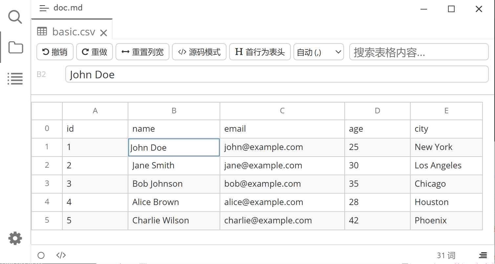

# Typora 插件 CSV

[English](./README.md) | 中文

这是一个基于 [typora-community-plugin][core] 的 [Typora](https://typoraio.cn) 插件。它为 `.csv` / `.tsv` 文件提供可视化表格编辑能力。参考了 Obsidian 的表格编辑插件 [csv-lite](https://github.com/LIUBINfighter/csv-lite)。

在文件树中点击 `.csv` / `.tsv` 文件，即可在标签页中以可编辑表格打开：增删行列、拖拽排序、搜索、固定行列、源码编辑都在表格中完成，改动会自动写回文件。

## 预览



## 功能

- **表格视图** — `.csv` / `.tsv` 以原生 DOM 表格渲染，跟随 Typora 亮/暗主题。
- **分隔符检测** — 自动识别逗号、分号、制表符与竖线；手动切换分隔符仅改变视图解析，不修改原文件格式。
- **单元格编辑** — 全局共享一个输入框，点击即可编辑；支持 <kbd>Enter</kbd> / <kbd>Tab</kbd> / <kbd>Shift</kbd>+<kbd>Tab</kbd> 移动、<kbd>Esc</kbd> 取消。
- **编辑栏** — 工具栏显示当前单元格的 A1 地址与完整内容，与单元格双向同步。
- **行列操作** — 右键行号/列名插入、删除、上移/下移、左移/右移，并保护表头行。
- **拖拽排序** — 拖动行号或列名重排行列，带源目标与插入位置指示器。
- **列宽调整** — 拖动列边缘调整宽度，或一键重置列宽。
- **首行为表头** — 一键将首行作为表头，按文件记忆。
- **固定行列** — 将任意行或列固定（sticky），并支持顶部横向滚动条。
- **撤销/重做** — 最多 50 步，覆盖单元格编辑与结构变更。
- **搜索** — <kbd>Ctrl</kbd>/<kbd>Cmd</kbd>+<kbd>F</kbd> 在表格内搜索，高亮命中并跳转到单元格。
- **链接识别** — 单元格内的 URL 与 `[文本](url)` 自动渲染为可点击链接。
- **大文件优化** — 超过 150 行时启用行虚拟化，滚动流畅；固定行时自动关闭并提示。
- **源码模式** — 在表格与原始文本之间切换，保留原始换行（含 CRLF）。
- **无损保存** — 保留原文件的分隔符、换行风格与结尾换行，自动去抖保存并在文件占用时重试。

## 用法

在 Typora 左侧文件树中点击任意 `.csv` / `.tsv` 文件，即以表格打开。

- 单击单元格进入编辑；<kbd>Enter</kbd> 提交并下移，<kbd>Tab</kbd> 提交右移，<kbd>Esc</kbd> 取消。
- 右键**行号**或**列名**打开菜单以插入/删除/移动行列。
- **拖动**行号或列名可重排；拖动列名右侧边缘可调整列宽。
- 点击行号、列名上的图钉按钮可固定该行/列。
- 工具栏按钮可撤销/重做、重置列宽、切换首行为表头、切换源码模式与分隔符。

## 命令

| 命令 | 说明 |
|---|---|
| 创建新 CSV 文件 | 在当前位置新建一个 `.csv` 文件并打开。 |

## 快捷键

| 快捷键 | 说明 |
|---|---|
| <kbd>Ctrl</kbd>/<kbd>Cmd</kbd>+<kbd>F</kbd> | 聚焦表格内搜索框 |
| <kbd>Ctrl</kbd>/<kbd>Cmd</kbd>+<kbd>Z</kbd> | 撤销 |
| <kbd>Ctrl</kbd>/<kbd>Cmd</kbd>+<kbd>Shift</kbd>+<kbd>Z</kbd> | 重做 |
| <kbd>Enter</kbd> / <kbd>Tab</kbd> / <kbd>Shift</kbd>+<kbd>Tab</kbd> / <kbd>Esc</kbd> | 编辑时提交/移动/取消 |

## 设置

打开「设置 -> 插件」中的 **CSV**：

| 设置 | 说明 |
|---|---|
| 字段分隔符 | 自动 / 逗号 / 分号 / 制表符 / 竖线。 |
| 引号字符 | 包围含特殊字符字段的引号字符，默认为 `"`。 |

## 安装

1. 安装 [typora-community-plugin][core]。
2. 打开「设置 -> 插件市场」搜索「CSV」并安装。

## 开发

```bash
pnpm install
pnpm run build:dev   # esbuild 开发构建，并安装到 Typora
pnpm run build       # rollup 发布构建
pnpm run pack        # 产出 plugin.zip
pnpm test            # 运行单元测试
pnpm run typecheck   # 类型检查
```

## License

MIT

[core]: https://github.com/typora-community-plugin/typora-community-plugin
